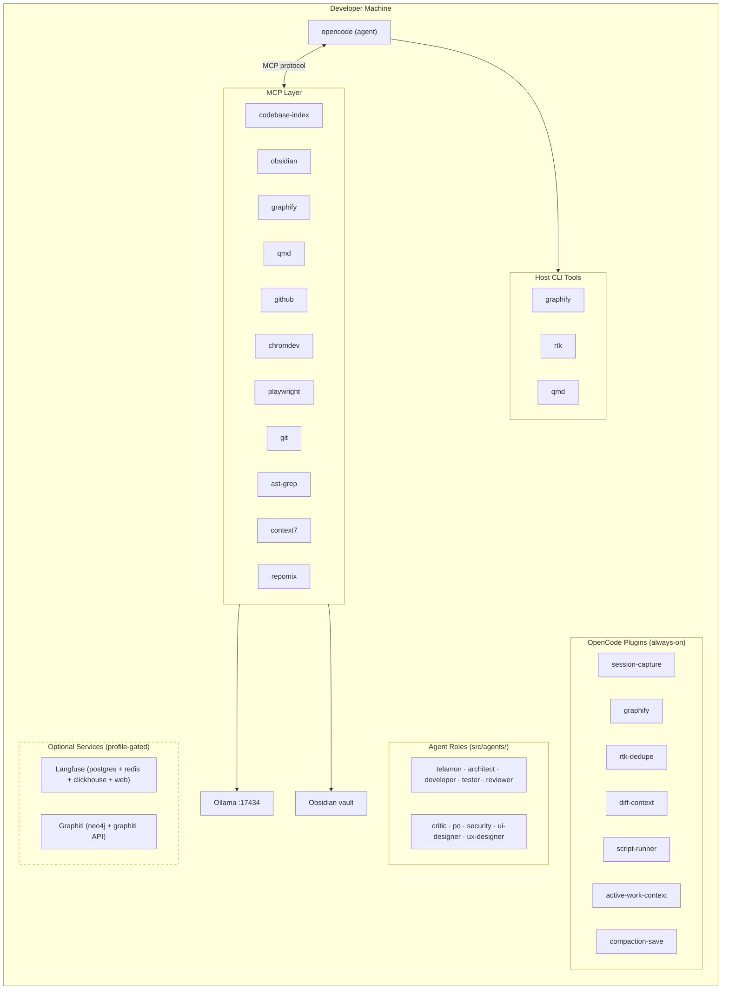

Telamon runs entirely on the developer's machine. An MCP layer connects the coding agent to local services
(Ollama, Obsidian) and external integrations (GitHub, browser DevTools).
OpenCode plugins inject context at session start, and host CLI tools handle indexing, search, and compression.

## System flow



---

## What each tool provides at each stage

| Stage                         | Tool                | Role                                                              |
|-------------------------------|---------------------|-------------------------------------------------------------------|
| **Session start**             | Obsidian `brain/`   | Loads goals, decisions, patterns, and known gotchas               |
| **Session start**             | QMD                 | Semantic vault search — surfaces related context before diving in |
| **Session start**             | Graphify plugin     | Injects god nodes, communities, and surprising connections        |
| **Session start**             | Diff-context plugin | Injects git change summary since last session                     |
| **Session start**             | Active-work-context | Injects active work items, prompts user to continue/archive       |
| **Understanding code**        | Graphify MCP        | Structural map: layers, god nodes, module relationships           |
| **Finding code**              | Codebase Index      | Semantic search: *"where is the auth logic?"*                     |
| **Reading many files**        | Repomix             | Packs directory into compressed context (~70% token reduction)    |
| **Finding code**              | ast-grep            | Structural search: find code by AST pattern                       |
| **Finding vault notes**       | QMD                 | Semantic vault search: *"did we ever deal with X?"*               |
| **Looking up docs**           | Context7            | Queries library/framework documentation                           |
| **Browser debugging**         | Chrome DevTools     | Inspects DOM, console, network, performance                       |
| **Browser testing**           | Playwright          | Automates browser interactions and assertions                     |
| **GitHub integration**        | GitHub MCP          | Manages issues, PRs, code search, reviews                         |
| **Writing code**              | RTK                 | Compresses bash output to save tokens                             |
| **Long sessions**             | Caveman             | Reduces response verbosity ~75% on demand                         |
| **After significant work**    | Obsidian `brain/`   | Stores new decisions, patterns, bug fixes                         |
| **Evaluating agent behavior** | promptfoo           | Automated quality checks: routing, plan structure, code review    |
| **After each agent turn**     | Session Capture     | Auto-promotes learnings every 30 min (throttled)                  |
| **On compaction**             | Compaction Save     | Writes compaction timestamp to each active work item              |
| **End of session**            | Obsidian `brain/`   | Saves session summary; archives completed work notes              |
| **Observability**             | Langfuse (optional) | Tracks token usage, latency, cost across sessions                 |
| **Temporal knowledge**        | Graphiti (optional) | Stores entities and relationships with temporal metadata          |

---

## Infrastructure

### Secrets

The installer writes one plain-text file per secret into `storage/secrets/` (git-ignored).
These are referenced by `storage/opencode.jsonc` using the `{file:...}` pattern — the agent never sees raw secrets in config, only file pointers.

| File                 | Contents                              |
|----------------------|---------------------------------------|
| `obsidian-api-key`   | Obsidian Local REST API key           |
| `graphify-python`    | Path to graphify's Python interpreter |
| `telamon-root`       | Path to the Telamon root directory    |
| `gh_pat`             | GitHub personal access token          |
| `qmd-cache-home`     | XDG_CACHE_HOME override for QMD       |

### Docker services

#### Core (always running)

| Service               | Image                  | Host port                              |
|-----------------------|------------------------|----------------------------------------|
| `telamon-ollama`      | `ollama/ollama:latest` | 17434                                  |
| `telamon-ollama-init` | `ollama/ollama:latest` | — (one-shot, pulls `nomic-embed-text`) |

> **Obsidian MCP** runs on-demand via `docker run` (not persistent) so it doesn't crash when Obsidian isn't running.

#### Langfuse (profile: `langfuse`)

| Service                       | Image                          | Host port         |
|-------------------------------|--------------------------------|-------------------|
| `telamon-langfuse-db`         | `postgres:16`                  | 17433             |
| `telamon-langfuse-redis`      | `redis:7-alpine`               | — (internal only) |
| `telamon-langfuse-clickhouse` | `clickhouse/clickhouse-server` | — (internal only) |
| `telamon-langfuse-web`        | `langfuse/langfuse:latest`     | 17400             |

#### Graphiti + Neo4j (profile: `graphiti`)

| Service            | Image                   | Host port                     |
|--------------------|-------------------------|-------------------------------|
| `telamon-neo4j`    | `neo4j:5`               | 17474 (browser), 17687 (bolt) |
| `telamon-graphiti` | `zepai/graphiti:latest` | 17801                         |

> All host ports are bound to `127.0.0.1` — not accessible from the network.

### Scheduled background jobs

`telamon init` creates platform-native timers that run every 30 minutes:

| Job                 | Command               | Scope       |
|---------------------|-----------------------|-------------|
| **Graphify update** | `graphify . --update` | Per project |

| Platform | Mechanism          | Location                                              |
|----------|--------------------|-------------------------------------------------------|
| Linux    | systemd user timer | `~/.config/systemd/user/<job-name>.{service,timer}`   |
| macOS    | launchd agent      | `~/Library/LaunchAgents/com.telamon.<job-name>.plist` |

Timers are idempotent — re-running `telamon init` does not create duplicates.

---

## Repository layout

### Top-level structure

| Directory  | Purpose                                                                  |
|------------|--------------------------------------------------------------------------|
| `bin/`     | Entry-point scripts (install, init, doctor, status, update, telamon CLI) |
| `src/`     | All source: agents, commands, plugins, skills, tools, shared functions   |
| `vendor/`  | External module repos cloned by `telamon module add` — git-ignored       |
| `storage/` | Runtime data — git-ignored                                               |
| `docs/`    | Documentation (this site)                                                |
| `test/`    | Test suite and agent evaluations                                         |
| `scripts/` | Utility scripts                                                          |

### Full directory tree

```
bin/
  init.sh                    # project initialiser (brain scaffold + symlinks + plugins)
  install.sh                 # orchestrator: --pre-docker, --post-docker phases
  update.sh                  # upgrades all Telamon-managed tools to latest versions
  doctor.sh                  # comprehensive health check (connectivity, config, secrets)
  status.sh                  # quick installation status of all Telamon tools
  telamon                    # global CLI dispatch script (symlink target)

src/
  AGENTS.md                  # main agent instructions file (symlinked into each project)
  agents/                    # agent role definitions (one .md per role)
    telamon.md               # orchestrator — classifies, delegates, leads workflows
    architect.md             # software architect — designs plans and ADRs
    critic.md                # critic — audits codebase, reviews plans
    developer.md             # developer — implements plans into production code
    po.md                    # product owner — domain expert, backlog grooming
    reviewer.md              # reviewer — reviews changesets against plan + conventions
    security.md              # security engineer — threat models, vulnerability assessment
    tester.md                # tester — validates implementations, writes tests
    ui-designer.md           # UI designer — visual specs, design tokens
    ux-designer.md           # UX designer — user flows, interaction specs
  commands/                  # slash commands (one .md per command)
  plugins/                   # OpenCode plugins
    graphify.js              # injects graph context into first tool call
    rtk.ts                   # RTK token compression integration
    rtk-dedupe.ts            # deduplicates RTK output
    session-capture.js       # auto-captures learnings before compaction
    diff-context.js          # injects git change summary on first bash call
    active-work-context.js   # injects active work items at session start
    compaction-save.js       # saves compaction timestamps to active work items
    lib/
      readme-utils.js        # shared utilities for README.md parsing
  skills/
    memory/                  # memory & context management skills
    dev/                     # development convention skills
    workflow/                # workflow orchestration skills
    addyosmani/              # general engineering skills (from addyosmani/agent-skills)
  functions/                 # shared bash library (colors, stdout, state, os, opencode, secrets, shell profile)
    autoload.sh              # auto-sources all functions in the directory
    colors.sh                # terminal color definitions
    install.sh               # shell profile PATH + env setup (merged from shell/)
    write-env.sh             # writes exports to shell RC file (merged from shell/)
    strip_jsonc.py           # JSON-with-comments parser
  tools/
    homebrew/                # Homebrew installer
    docker/                  # Docker installer
    python/                  # Python (uv) installer
    nodejs/                  # Node.js installer
    graphify/                # Graphify binary + MCP wrapper + scheduled updates + plugin
    graphiti/                # Graphiti + Neo4j setup (optional, profile-gated)
    langfuse/                # Langfuse observability stack (optional, profile-gated)
    caveman/                 # Caveman skill download
    qmd/                     # QMD binary + skill download + vault collection init
    rtk/                     # RTK binary + opencode plugin wiring
    opencode/                # opencode binary + shared opencode.jsonc template
    codebase-index/          # MCP registration + per-project config
    obsidian/                # Obsidian binary install + MCP registration
    repomix/                 # Repomix MCP installer, init, update, doctor
    promptfoo/               # promptfoo eval framework installer, init, update
    session-capture/         # session-capture opencode plugin + init
    diff-context/            # diff-context opencode plugin registration
    cli/                     # telamon CLI + desktop menu entry installer

test/
  test-init.sh               # assertions for make init wiring
  eval/                      # agent evaluation suite (promptfoo)
    promptfooconfig.yaml     # root eval config
    evals/                   # per-eval YAML configs
    fixtures/                # test inputs per eval

storage/                     # runtime data — git-ignored except opencode.jsonc
  opencode.jsonc             # shared opencode config (tracked); projects symlink to this
  secrets/                   # one plain-text file per secret (git-ignored)
  state/                     # installer state (saved inputs, completed steps)
  ollama/                    # Ollama model cache
  graphify/                  # Graphify output cache
  qmd/                       # QMD index and cache
  obsidian/<project-name>/   # per-project Obsidian vault
```
